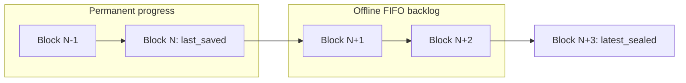
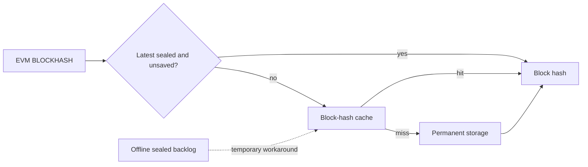

# Block continuity

## Progress model

Stratus tracks two process-local progress tips:

- `latest_sealed` is the execution tip. Temporary storage owns its latest in-process state overlay and final hash. Its hash is the parent used to build the next header; after startup, the durable underlying state still comes from RocksDB.
- `last_saved` is the durable tip. `StratusStorage` stores only its block number and hash because the complete block and state already live in RocksDB.

On a populated database, both are initialized from the latest permanent block. On an empty database, temporary storage starts from the canonical sealed genesis while `last_saved` remains empty until genesis is persisted.

Normal leader and follower flows seal and save sequentially, so the tips usually match. The offline importer deliberately pipelines execution and persistence, allowing `latest_sealed` to run ahead.



These are not independent chains. Permanent progress must always be an ordered prefix of sealed progress.

## Hash schemes

Genesis retains the legacy V1 hash:

```text
V1 = keccak256(number as 8-byte big-endian)
```

Locally sealed non-genesis blocks use V2:

```text
V2 = keccak256(
    number as 8-byte big-endian
    || timestamp as 8-byte big-endian
    || transactions_root
    || parent_hash
)
```

Reexecution validates that the imported hash is V2 or the temporary V1 compatibility hash. Replication receives a prebuilt block and relies on the universal saved-chain continuity checks.

## Guarded sealing

`PendingSession` owns a `PendingBlockGuard`, which wraps temporary storage's `pending_session` mutex colocated with `InMemoryChainState`. Callers use session methods instead of manually pairing lock-acquiring methods with variants that accept an existing guard.

One session spans the complete pending-block lifecycle:

```text
set pending header when importing
→ execute and save transactions
→ snapshot pending state
→ build the block and determine its final hash
→ finish pending state
```

Local sealing and reexecution use the snapshot to build a block without destroying pending state. Local sealing calculates V2; reexecution validates the external V2 or V1 hash. If external validation fails, pending remains unchanged. Replication skips this snapshot-and-build step because it receives a complete block.

Once the block is accepted, `finish_pending_block` uses `std::mem::replace` to move the original pending state into `latest_sealed`, attaches the final hash, and creates the next pending state.

Pending and latest sealed state share one `RwLock<InMemoryChainState>`, so the move, hash update, and next-pending creation are one atomic write. Another pending session cannot start until `PendingSession` is dropped or consumed by sealing.

Local synchronous modes also retain the existing `mine_and_commit` mutex from sealing through persistence. It guarantees that concurrent local triggers cannot seal blocks in one order and race to save them in another order. Offline importer does not use this mutex; its single executor, FIFO channel, and single saver provide ordering.

## Saving and continuity

`save_block` is the authoritative continuity boundary for leader mining, follower reexecution, follower replication, fake leader, and offline import.

Before saving block `N`, it validates:

```text
N == last_saved.number + 1
N.parent_hash == last_saved.hash
```

RocksDB is written only after these checks pass. `last_saved` advances only after the write succeeds, and no permanent read is required during each save.

Online follower modes perform the same check as a read-only preflight before emitting Kafka events. `save_block` repeats it authoritatively before persistence.

External reexecution calculates the block locally and accepts the external V2 hash or the temporary V1 compatibility hash. Replication receives a prebuilt block, but both modes still pass through the universal saved-chain continuity check.

If the process restarts, sealed-but-unsaved work is discarded. The durable tip is loaded from RocksDB, temporary state resumes from it, and the unsaved range is executed again.

## Block-hash lookup

The block-hash cache does not determine chain progress or parent continuity. Its normal role is accelerating the EVM `BLOCKHASH` opcode.



Lookup order is:

1. The latest sealed block, but only while it is ahead of `last_saved`.
2. The block-hash cache.
3. Permanent storage.

The normal cache default is 256 entries and administrators may set it to zero. Importer-offline always adds capacity for its bounded sealed-but-unsaved backlog:

```text
configured capacity + batch_size × (queue_size + 2)
```

The extra two batches cover one batch being built by the executor and one being processed by the saver.

Older unsaved offline blocks are temporarily dependent on this cache because permanent storage cannot serve them yet. Remove this workaround when importer-offline is removed.

## Lock roles

- `PendingSession`: exposes pending-header setup, execution append, and sealing under one temporary-storage session lock.
- `PendingBlockGuard`: private capability held by `PendingSession` and passed only to lower storage layers.
- `TransactionGuard`: lets fake leader hold the executor transaction mutex before miner locks, matching RPC lock order and preventing deadlock.
- `mine_and_commit`: preserves seal-to-save ordering for synchronous local modes.
- `commit`: serializes permanent writes.
- `last_saved`: serializes durable continuity validation and advancement.
- `transient_state_lock`: preserves consistency between permanent writes and latest account/slot caches.

## TODO: Temporary storage naming

`InmemoryTransactionTemporaryStorage` and `transaction_storage` are misleading names. This component does not represent one Ethereum transaction or a database transaction. It owns:

- The pending block header and all transaction executions.
- Aggregated pending account and slot changes.
- The latest sealed block state and hash.
- The transition from pending to latest sealed.

For example, an interval-mined pending block can contain many Ethereum transactions. When sealed, the complete pending state becomes `latest_sealed`; an individual transaction does not.

A future focused refactor should rename it. Preferred naming is `InMemoryBlockStateStorage` with a `block_storage` field. `InMemoryExecutionStateStorage` with `execution_storage` is another reasonable option.