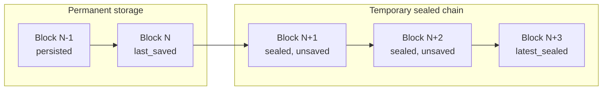
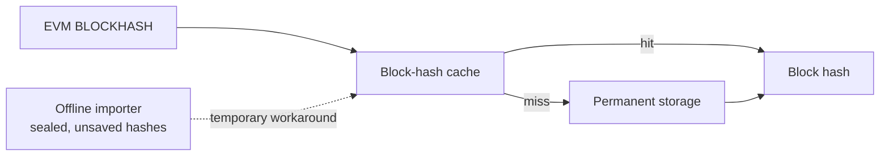

# Block continuity

## Chain progress

Stratus tracks two in-memory chain tips:

- `latest_sealed` is the execution tip. Temporary storage advances it whenever a block is sealed and uses it to build the next block header.
- `last_saved` is the durable tip. It advances only after permanent storage successfully saves a block.

Both tips contain the block number and hash. They are initialized from the latest permanent block at startup. During normal leader and follower operation they usually advance together. The offline importer can seal blocks faster than it saves them, so `latest_sealed` may be far ahead of `last_saved`.



Sealing uses `latest_sealed.hash` as the next header's `parent_hash`, then advances `latest_sealed` to the newly sealed block. This operation does not decide what belongs to the durable chain.

`save_block` is the universal continuity boundary for leader mining, follower reexecution, and follower replication. Before saving block `N`, it validates in memory that:

```text
N == last_saved.number + 1
N.parent_hash == last_saved.hash
```

Permanent storage is written only after those checks pass. `last_saved` advances to `N` only after the write succeeds. No permanent-storage read is required during saving.

If the process restarts, sealed-but-unsaved work is discarded. Both tips are restored from the durable permanent tip and the unsaved range is executed again.

## Block-hash cache

The block-hash cache is independent of chain progress. Neither sealing nor saving uses it to decide the parent or validate continuity.



Its normal purpose is to accelerate the `BLOCKHASH` opcode, with permanent storage as the source on a cache miss.

The offline importer is a temporary exception: execution can run ahead of persistence, so hashes of sealed-but-unsaved blocks exist only in memory. The importer currently publishes those hashes into the cache so `BLOCKHASH` can resolve them before they are saved.

This importer dependency is a workaround, not part of the chain-continuity model. When the offline importer is removed, remove the workaround and reduce the block-hash cache to the size needed only for opcode performance.
