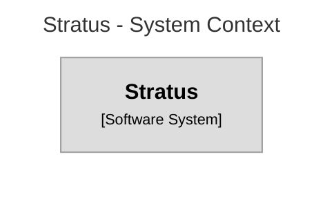

```mermaid
graph TB
  linkStyle default fill:#ffffff

  subgraph diagram ["Stratus - System Context"]
    style diagram fill:#ffffff,stroke:#ffffff

    1["<div style='font-weight: bold'>Stratus</div><div style='font-size: 70%; margin-top: 0px'>[Software System]</div>"]
    style 1 fill:#dddddd,stroke:#9a9a9a,color:#000000

  end
```